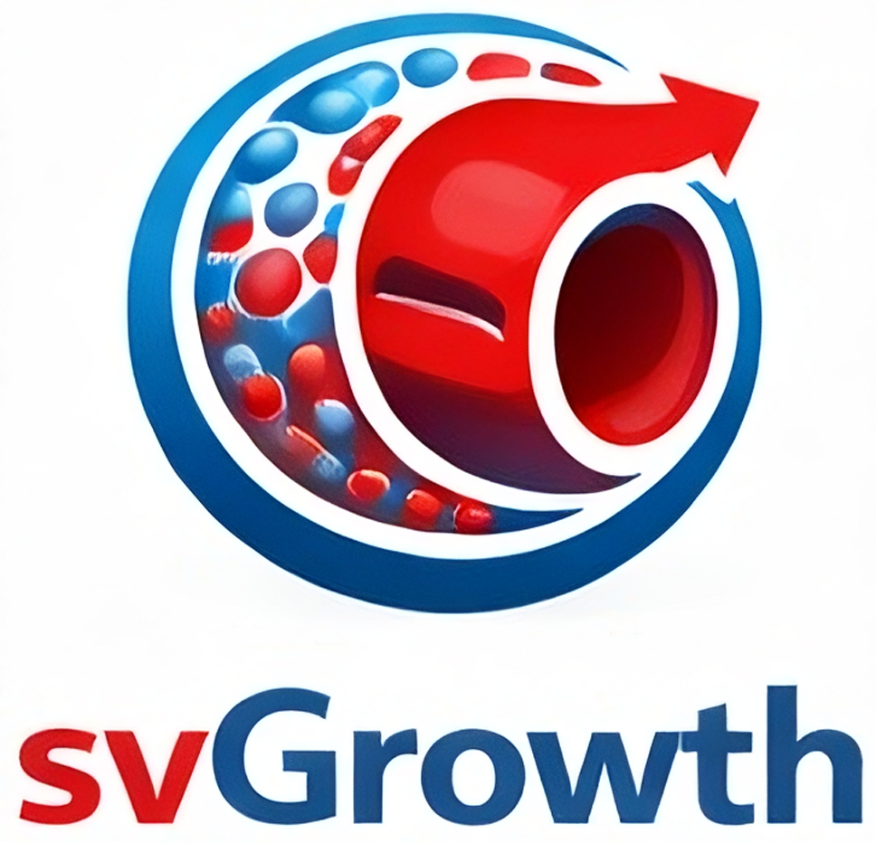

<div align="center">

<p align="center">
  
</p>

[](https://github.com/StanfordCBCL/svGrowth/actions/workflows/test.yaml)
[](https://codecov.io/gh/StanfordCBCL/svGrowth)
[](https://www.python.org/downloads/)


</div>

<div align="center">

svGrowth is a modular computational framework for simulating growth and remodeling (G&R) in biological tissues based on the constrained mixture theory. 

🚧 svGrowth is currently in early development. API is subject to change. 🚧
</div>

---

## Background
svGrowth is based on the constrained mixture theory developed by Humphrey & Rajagopal (2002), where tissues adapt to mechanobiological stimuli through continuous turnover of their structurally-significant constituents:

> **Humphrey, J. D., & Rajagopal, K. R. (2002)**  
> *A constrained mixture model for growth and remodeling of soft tissues*  
> **Mathematical Models and Methods in Applied Sciences**, 12(03), 407-430.  
> DOI: [10.1142/S0218202502001714](https://doi.org/10.1142/S0218202502001714)

## Key Features

✅ **Scalable Multi-Layer Architecture**  
Single-layer to multi-layer geometries with unlimited constituents per layer, including multi-fiber families with distinct fiber orientations.

✅ **Geometry-Agnostic Framework (in dev)**  
Built-in support for axisymmetric shapes (cylinders, spheres, ellipsoids) with thin/thick wall assumptions. Designed for future integration with arbitrary 3D geometries and finite element coupling.

✅ **Extensive Constitutive Library**  
Pre-built models for constituent mechanics (neo-Hookean, Fung exponential) and turnover kinetics (stress-mediated, shear-mediated, inflammation-mediated), with flexible support for user-defined models.

✅ **End-to-End Simulation Pipeline (in dev)**  
Complete workflow from experimental data and G&R parameter fitting to post-processing analysis and figures.

✅ **Comprehensive Testing Framework**    
Dedicated unit, integration, and end-to-end testing framework to validate individual components, coupled subsystems, and full pipeline behavior. Continuous integration ensures cross-platform reproducibility.

✅ **Developer-Friendly**  
Designed for researchers interested in extending the framework. Modular architecture with small, readable functions and integrated testing/profiling tools promote long-term, sustainable development.

## Installation

### Prerequisites

- **Python 3.9+**
### Install from Source

```bash
git clone https://github.com/StanfordCBCL/svGrowth.git

# Install dependencies
cd svGrowth
pip install -r requirements.txt

# For developers
pip install -r requirements-dev.txt
```

## Quick Start

### Running Your First Simulation

All you need to launch a G&R simulation is a YAML parameter file. Documentation for available configuration options is currently under development.

An example parameter file is provided in [`examples/latorre2018.yaml`](examples/latorre2018.yaml), which reproduces the cerebral artery model from:

> **Latorre, M., & Humphrey, J. D. (2018)**  
> *A mechanobiologically equilibrated constrained mixture model for growth and remodeling of soft tissues*  
> **ZAMM-Journal of Applied Mathematics and Mechanics**, 98, 2048–2071.  
> DOI: [10.1002/zamm.201700302](https://doi.org/10.1002/zamm.201700302)

### Run the Example

```bash
cd svGrowth/src

# Run simulation with example parameter file
python main.py --input ../examples/latorre2018.yaml --output ../sim_results
```

## Documentation

| Resource | Description | Status |
|----------|-------------|--------|
| **[Architecture Breakdown](documentation/architecture_breakdown.ipynb)** | Introductory guide to svGrowth architecture and data flow | ✅ Available |
| **[API Reference](documentation/)** | Class-level function summaries | 🚧 Partial |
| **User Guide** | Tutorials and examples | 📋 Planned |
| **Theory Guide** | Mathematical background | 📋 Planned |


## Contributing

Contributions are welcome! We are currently finalizing contribution guidelines. In the meantime:

### Request features or report bugs

1. **Search existing issues** — Your problem may already be documented.
2. **Open a new issue** — Use the issue templates for "Feature request" or "Bug report". See previous issues for styling and format.

## Citation

If you use svGrowth in your research, please cite:

```bibtex
@software{svGrowth,
  author = {TBD},
  title = {TBD},
  year = {TBD},
}
```