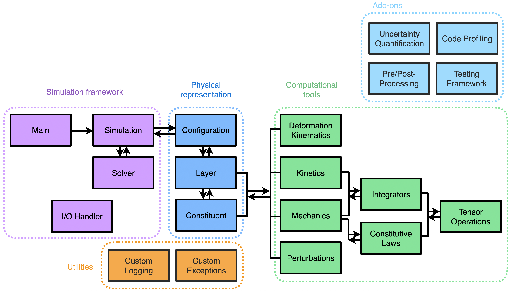

<div align="center">

<p align="center">
  
</p>

[](https://github.com/StanfordCBCL/svGrowth/actions/workflows/test.yaml)
[](https://codecov.io/gh/StanfordCBCL/svGrowth)


</div>

<p style="text-align: center;"> svGrowth is a modular computational framework for simulating growth and remodeling (G&R) in biological tissues based on the constrained mixture theory. </p>

<p style="text-align: center;"> svGrowth is currently in development. </p>

<h1></h1>

### Key Features

- **Constrained mixture theory**: Multiple constituents with individual kinetics and mechanics
- **Multi-fiber families**: Support for oriented fiber families (e.g., circumferential, axial, diagonal collagen)
- **Flexible kinetics**: Stimulus-driven production and degradation rates
- **Multiple integration methods**: Simpson's rule and trapezoidal integration
- **Optimized survival computation**: O(n) backward iteration algorithm for efficient heredity integrals
- **Modular architecture**: Clean separation between kinematics, mechanics, and kinetics


### Code architecture

<p align="center">
  
</p>


## Installation

```bash
# Clone the repository
git clone https://github.com/yourusername/svGrowth.git
cd svGrowth

# Install dependencies
pip install -r requirements.txt
```

**Requirements:**
- Python 3.9+
- NumPy
- PyYAML

## Quick Start

```bash
# Run example simulation (Latorre et al. 2018 cerebral artery model)
python main.py
```

This will:
1. Load parameters from latorre2018_updated.yaml
2. Initialize a single-layer cerebral artery model
3. Simulate 700 days of G&R
4. Save results to `outputdir/`

## Project Structure

```
svGrowth/
├── main.py                      # Entry point
├── simulation.py                # Main simulation loop
├── configuration.py             # Multi-layer vessel configuration
├── layer.py                     # Single layer (e.g., media, adventitia)
├── constituent.py               # Constituent classes (single/multi-fiber)
├── kinetics.py                  # Production, degradation, survival
├── kinetics_interface.py        # Data access adapter for kinetics
├── mechanics.py                 # Stress computations
├── mechanics_interface.py       # Data access adapter for mechanics
├── deformation_kinematics.py    # Thin-wall/thick-wall kinematics
├── constitutive_laws.py         # Constitutive models (Neo-Hookean, Fung)
├── integrators.py               # Numerical integration (Simpson, trapezoidal)
├── tensor_operations.py         # Tensor algebra utilities
├── io_handler.py                # YAML I/O
└── latorre2018_updated.yaml     # Example parameter file
```

## Usage

### 1. Define Your Model (YAML)

```yaml
layers:
  - layer_name: "media"
    rhoR_h: 1050.0  # Reference density (kg/m³)
    
    geometry:
      type: "thin_wall_cylinder"
      a_h: 1.40   # Inner radius (mm)
      h_h: 0.12   # Thickness (mm)
      lambda_z_h: 1.0
    
    loading_variables:
      P_h: 14.18  # Pressure (kPa)
      Q_h: 1.0    # Flow rate (m³/day)
    
    constituents:
      elastin:
        mass_fraction: 0.02
        constitutive_model:
          type: "neo_hookean"
          parameters:
            c: 70.6  # kPa
      
      collagen:
        constituent_type: "multi_fiber_family"
        shared_properties:
          total_mass_fraction: 0.22
          kinetics:
            degradation:
              deg_rate:
                type: "quadratic"
                k_alpha_h: 0.1  # 1/day
                gain_params:
                  intramural_stress: 1.0
            production:
              stimulus_function_form: "linear"
              gain_params:
                intramural_stress: 1.0
        
        fiber_families:
          circumferential:
            mass_fraction_ratio: 0.6
            constitutive_model:
              type: "fung_exponential"
              parameters:
                c1: 672.5
                c2: 22.0
```

### 2. Run Simulation

```python
from io_handler import IOHandler
from configuration import Configuration
from simulation import Simulation

# Load parameters
io_handler = IOHandler()
params = io_handler.load_parameters("your_model.yaml")

# Create configuration
config = Configuration.from_parameters(params)

# Run simulation
sim = Simulation(
    configuration=config,
    dt=1.0,              # Time step (days)
    n_steps=700,         # Number of steps
    integration_method='simpson',
    survival_function_computation='backward'
)
sim.run()
```

## Theory

### Constrained Mixture Model

The framework implements:

1. **Mass balance** (referential mass density):
   ```
   ρᴿ_α(s) = ∫[τ_min to s] mᴿ_α(τ) q(s,τ) dτ
   ```

2. **Stress balance** (Cauchy stress):
   ```
   σ = Σ_α ∫[τ_min to s] (mᴿ_α(τ) q(s,τ)/ρᴿ_h) σ̂_α(s,τ) dτ - λI
   ```

3. **Survival function** (exponential decay):
   ```
   q(s,τ) = exp(-∫[τ to s] k_α(t) dt)
   ```

Where:
- `s` = current time, `τ` = deposition time
- `mᴿ_α` = production rate (kg/(m³·day))
- `k_α` = degradation rate (1/day)
- `q(s,τ)` = survival fraction
- `σ̂_α` = constituent stress
- `λ` = Lagrange multiplier (enforces σᵣ = 0)

### Kinematics

**Thin-wall cylindrical** (current implementation):
```
F = diag(λᵣ, λ_θ, λ_z)
λ_θ = r_mid / R_mid
λ_z = prescribed
λᵣ = 1/(λ_θ λ_z)  (incompressibility)
```

## Architecture Highlights

### 1. **Separation of Concerns**
- **Kinematics**: Geometry → deformation gradient F
- **Mechanics**: F → stress σ (constitutive models)
- **Kinetics**: Stimuli → production/degradation rates

### 2. **Adapter Pattern**
- `KineticsContext`: Decouples kinetics from data structure
- `MechanicsContext`: Decouples mechanics from data structure

### 3. **Factory Pattern**
- `IntegratorFactory`: Create integrators by name
- `KinematicsFactory`: Create kinematics by geometry type
- `ConstitutiveModel.from_parameters()`: Parse YAML to models

### 4. **Strategy Pattern**
- `SurvivalFunctionComputation`: Pluggable survival algorithms (naive O(n²) vs backward O(n))

## Examples

See latorre2018_updated.yaml for a complete cerebral artery model from:

> Latorre, M., & Humphrey, J. D. (2018). Modeling mechano-driven and immuno-mediated aortic maladaptation in hypertension. *Biomechanics and Modeling in Mechanobiology*, 17(5), 1497-1511.

## Contributing

Contributions are welcome! Key areas for extension:

- [ ] Thick-wall kinematics (including spherical geometries)
- [ ] Active smooth muscle contraction
- [ ] Multi-layer contact constraints
- [ ] Residual stress computation
- [ ] Finite element integration

## License

MIT License - see LICENSE file

## Citation

If you use svGrowth in your research, please cite:

```bibtex
@software{TBD,
  author = {Your Name},
  title = {svGrowth: A Python Framework for Growth and Remodeling},
  year = {TBD},
}
```

## References

1. Humphrey, J. D., & Rajagopal, K. R. (2002). A constrained mixture model for growth and remodeling of soft tissues. *Mathematical Models and Methods in Applied Sciences*, 12(03), 407-430.

2. Baek, S., Rajagopal, K. R., & Humphrey, J. D. (2006). A theoretical model of enlarging intracranial fusiform aneurysms. *Journal of Biomechanical Engineering*, 128(1), 142-149.

3. Latorre, M., & Humphrey, J. D. (2018). Modeling mechano-driven and immuno-mediated aortic maladaptation in hypertension. *Biomechanics and Modeling in Mechanobiology*, 17(5), 1497-1511.

## Contact

For questions or issues, please open an issue on GitHub or contact [lazaros@stanford.edu](mailto:lazaros@stanford.edu).

---

**Status**: Early development - API subject to change
